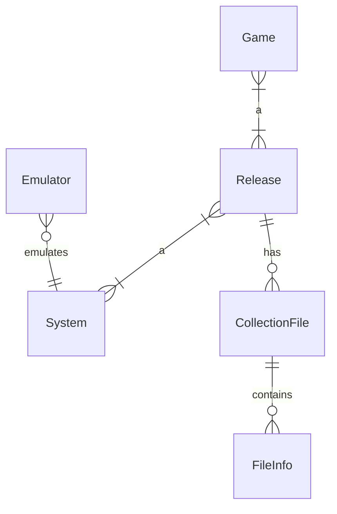

# iced game collection

A desktop app to manage your game collection written in Rust with iced.
Application structure inspired by icebreaker app.

Currently saves collection to JSON-file on exit and loads the collection on start up.

# Data model

A game can belong to multiple releases and a release can contain multiple games (compilation).

A collection file can be a single file or an archive file containing multiple files.
Collection file should also have a type, whether is a file for emulator (rom, disk or tape image), manual, box scan or some other kind of file.

# Adding a release

## Picking files for a release

A file can be a rom or some kind of disk or tape image. It can be single zip -compressed file or it can be a zip-archive containing several files. 

Several files and archive files can be also added to a release.

If destination folder is selected for the system, files are copied from source folder to the destination folder.

## Running a file with emulator

When multiple files are added for release, user can select which one to use as a start up file.

