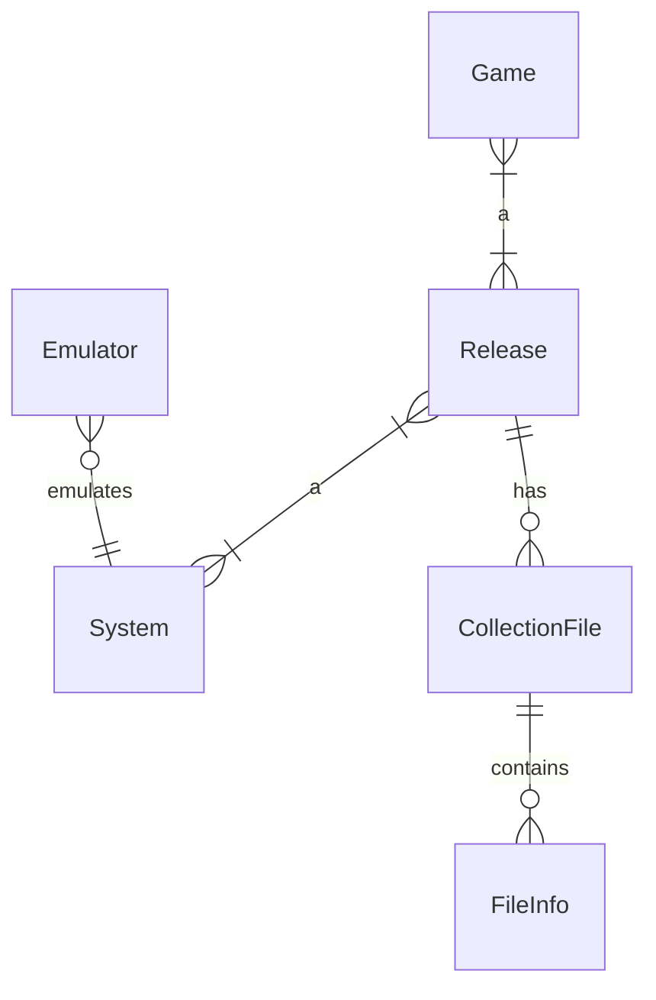
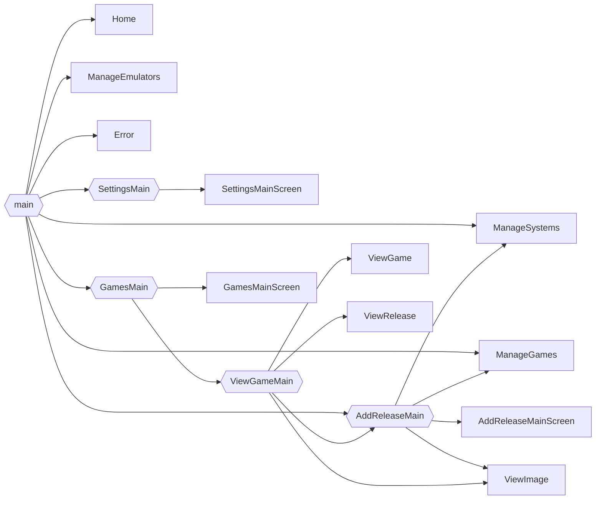

# iced game collection

A desktop app to manage your game collection written in Rust with iced for GUI and polodb for data storage.

Application structure inspired by icebreaker app.

Currently saves collection to JSON-file on exit and loads the collection on start up => in progress to store data to PoloDB database.

# Data model

A game can belong to multiple releases and a release can contain multiple games (compilation).

A collection file can be a single file or an archive file containing multiple files.
Collection file should also have a type, whether is a file for emulator (rom, disk or tape image), manual, box scan or some other kind of file.

# UI Components

# Starting

Collection root dir must be set before anything else can be done.

All the files added to collection will be copied to sub directories under collection root dir.

## Collection directory structure

- collection root dir
    - system 1
        - roms 
        - images
        - manuals
        - screenshots
        - cover scans
    - system 2
        - ...

# Adding a release

## Picking files for a release

A file can be a rom or some kind of disk or tape image. It can be single zip -compressed file or it can be a zip-archive containing several files. 

Several files and archive files can be also added to a release.

Files are copied from source folder to the system folder under collection root folder folder.

Files can be also moved manually to a folder in collection directory tree, then by selecting file it's not copied anywhere if it's in the right folder.

TODO: user should be able to selected whether the files are being copied or moved to collection folder.

## Running a file with emulator

When multiple files are added for release, user can select which one to use as a start up file.

## PoloDB

PoloDB requires libclang-dev to be installed.